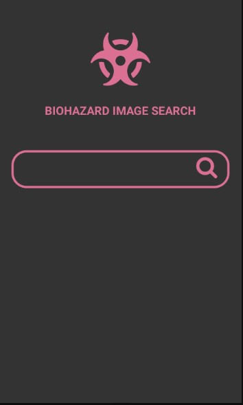
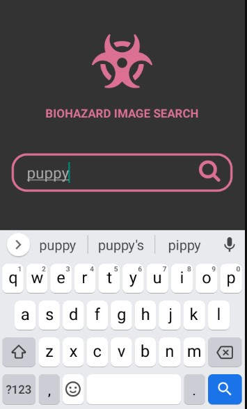
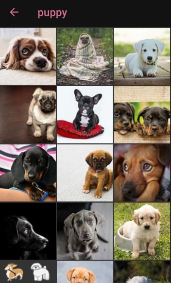
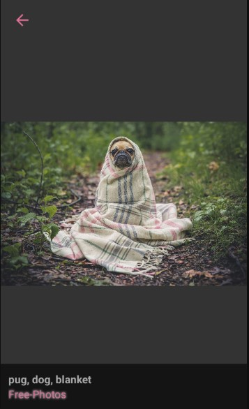

<br/>
<p align="center">
  <a href="https://github.com/abhishekangira/biohazard">
    
  </a>

  <h3 align="center">Biohazard Image Search</h3>
  <h3 align="center"><a href="https://drive.google.com/file/d/1PyG1hHZeMz8fwY9rIu_G1MAoNoyP0SjL/view?usp=sharing">Download APK</a></h3>
  

  <p align="center">
    A very basic image search with a catchy name.
    <br/>
    <br/>
  </p>
</p>

## Table Of Contents

* [Screenshots](#screenshots)
* [Built With](#built-with)
* [Getting Started](#getting-started)
  * [Prerequisites](#prerequisites)
  * [Installation](#installation)
* [Authors](#authors)


## Screenshots







## Built With

React Native

## Getting Started

This is an example of how you may give instructions on setting up your project locally.
To get a local copy up and running follow these simple example steps.

### Prerequisites

This is an example of how to list things you need to use the software and how to install them.

* npm

```sh
npm install npm@latest -g
```

### Installation

1. Clone the repo

```sh
git clone https://github.com/your_username_/Project-Name.git
```

2. Install NPM packages

```sh
npm install
```

3. Run on android simulator

```JS
npm run android
```
## Authors

* **Abhishek Angira** - *Frontend Engineer*
